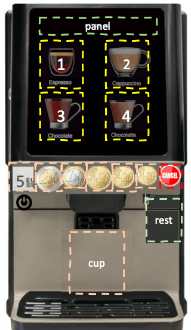

# Μαθαίνω Python μέσα από ένα πρότζεκτ

Εμβαθύνουμε στη γλώσσα προγραμματισμού Python μέσα από διαδοχικές λύσεις του ίδιου προβλήματος που ξεκινάνε από ένα απλό σχετικά πρόβλημα/λύση και καταλήγουν σε μια σύνθετη εφαρμογή μιας επιχείρησης διαχείρισης μηχανών πώλησης ροφημάτων καφέ.

Οι φάσεις είναι:

- Έκδοση 1: λύση με απλές προγραμματιστικές δομές
- Έκδοση 2: λύση με συναρτήσεις και πιο σύνθετες προγραμματιστικές δομές (λίστες, λεξικά)
- Έκδοση 3: λύση με κλάσεις
- Έκδοση 4: λύση με κλάσεις και διαχείριση του περιεχομένου, και του ταμείου (κέρματα)
- Έκδοση 5: λύση όπως προηγούμενα με προσθήκη γραφικής διεπαφής
- Έκδοση 6: λύση στην οποία προσθέτουμε τη σύνδεση με βάση δεδομένων για συντήρηση του ιστορικού πωλήσεων της μηχανής
- Έκδοση 7: λύση με τη βάση δεδομένων διαχείρισης πολλαπλών μηχανών με γεωγραφική διασπορά.
- Έκδοση 8: λύση με προσομοίωση της λειτουργίας του προσομοιωτή πολλαπλών μηχανών

### Το αρχικό πρόβλημα

Υποθέτουμε ότι μία αυτόματη μηχανή προσφέρει τέσσερα διαφορετικά είδη ροφημάτων (καφέ, καφέ με γάλα, σοκολάτα και σοκολάτα με γάλα), που κοστίζουν 1.50€, 1.80€, 2.10€ και 2.40€ αντίστοιχα. Η μηχανή δέχεται κέρματα των 10, 20 και 50 λεπτών, του ενός (1) ευρώ και των δύο (2) ευρώ, καθώς και χαρτονομίσματα των 5€, και επιστρέφει ρέστα. 


Να υλοποιηθεί πρόγραμμα, το οποίο:

α) Να εμφανίζει κατάλογο επιλογής (μενού) των προσφερόμενων ειδών (αριθμούμενα από το 1 έως το 4) με το αντίστοιχο αντίτιμο για το καθένα, την επιλογή 0 για έξοδο από το πρόγραμμα και στη συνέχεια διαβάζει την επιλογή του χρήστη (είδος που προτιμά ή έξοδος), εφαρμόζοντας αμυντικό προγραμματισμό προκειμένου να διασφαλιστεί ότι ο χρήστης εισάγει τιμή μεταξύ του 0 και του 4.

β) Στη συνέχεια, να εμφανίζει στην οθόνη το ποσό που απαιτείται για την πληρωμή του είδους που επέλεξε ο χρήστης. Ακολούθως, κατά την εισαγωγή του ποσού από τον χρήστη να χρησιμοποιηθεί αμυντικός προγραμματισμός, ώστε το ποσό που θα εισαχθεί να αντιστοιχεί σε αποδεκτό κέρμα ή χαρτονόμισμα. Το πρόγραμμα να ελέγχει εάν το ποσό που εισήχθη είναι μεγαλύτερο ή ίσο του απαιτούμενου ποσού. Στην περίπτωση που έχει εισαχθεί ποσό μικρότερο από το απαιτούμενο, το πρόγραμμα τυπώνει κατάλληλο μήνυμα (με το επιπλέον ποσό που πρέπει να εισαχθεί) και προτρέπει τον χρήστη να εισάγει περισσότερα χρήματα. Αυτή η διαδικασία συνεχίζεται μέχρι να εισαχθεί συνολικά ποσό ίσο με ή μεγαλύτερο από το ποσό που απαιτείται για την αγορά του είδους που επελέγη από το χρήστη.

γ) Να υπολογίζει το υπόλοιπο ποσό (ρέστα) που πρέπει να επιστραφεί (διαφορά του συνολικού εισαχθέντος ποσού από το αντίτιμο) και να τυπώνει κατάλληλο μήνυμα που ενημερώνει το χρήστη για το ποσό που θα του επιστραφεί.

δ) Να υπολογίζει το ελάχιστο πλήθος κερμάτων που θα επιστραφούν στον χρήστη ως υπόλοιπο (ρέστα) και να τυπώνει μήνυμα με πόσα και ποιας αξίας κέρματα πραγματοποιείται αυτό. Το πρόγραμμα θα δέχεται από τον χρήστη τα ποσά σε ευρώ με ακρίβεια δυο δεκαδικών ψηφίων, αλλά θα χειρίζεται τα ποσά σε λεπτά.

### Έκδοση 1. Με απλές προγραμματιστικές δομές

```python
# myCoffeeMaker - έκδοση 1

# ερώτημα (α)
choice = -1 # αρχικοποίηση επιλογής
while ( choice < 0 or choice > 4): # εμφάνιση επιλογών
    print(" Δίνονται οι παρακάτω επιλογές:")
    print(" 1. Καφές: 1.5 ευρώ")
    print(" 2. Καφές με γάλα: 1.8 ευρώ")
    print(" 3. Σοκολάτα: 2.1 ευρώ")
    print(" 4. Σοκολάτα με γάλα: 2.4 ευρώ")
    print(" 0. Έξοδος")
    reply = input("Παρακαλώ εισάγετε την επιλογή σας (1-4) ή πατήστε 0 για έξοδο: ") # είσοδος επιλογής
    if len(reply) == 1 and reply in "01234": choice = int(reply)

# ερώτημα (β)
if (choice != 0 ):
    if (choice == 1 ):
        antitimo = 150
    elif (choice == 2 ):    
        antitimo = 180
    elif (choice == 3 ):
        antitimo = 210
    elif (choice == 4 ):
        antitimo = 240
    poso = 0    # αρχικοποίηση
    while (poso < antitimo):    # αρχικοποίηση
        ikerma=0
        while (ikerma != 10 and ikerma != 20 and ikerma != 50 and ikerma != 100 and ikerma != 200 and ikerma != 500 ):
            print("Πρέπει να εισάγετε","{:3.1f}".format((antitimo - poso)/100),"ευρώ συνολικά")
            while True:
                try:
                    kerma = float(input("Πόσα εισάγετε; "))
                    break
                except:
                    print('παρακαλώ εισάγετε το ποσό σε ευρώ')
            ikerma = kerma * 100
            if (ikerma != 10 and ikerma != 20 and ikerma != 50 and ikerma != 100 and ikerma != 200 and ikerma != 500 ):
                print("\tΣΦΑΛΜΑ: εισαγωγή μη έγκυρου ποσού.");
                print("\tΠαρακαλώ, εισάγετε μία έγκυρη τιμή: 0.1 / 0.2 / 0.5 / 1 / 2 / 5 ");
        poso = poso + ikerma

# ερώτημα (γ)
    # υπολογισμός υπόλοιπου (ρέστα) και αριθμού κερμάτων ανά είδος κέρματος που πρέπει να επιστραφούν
    resta = poso - antitimo # υπολογισμός υπολοίπου
    print("Eπιστροφή", "{:3.1f}".format(resta/100), "ευρώ") 

# ερώτημα (δ)
    if (resta): # αν υπάρχουν ρέστα
        print("Παρακαλώ πάρτε")
        dieura = resta // 200 # υπολογισμός επιστροφής κερμάτων 2€
        resta = resta - 200 * dieura # ενημέρωση υπολοίπου ποσού
        if ( dieura > 0 ):
            print(" δίευρα :", int(dieura))
        monoeura = resta // 100 # υπολογισμός επιστροφής κερμάτων 1€
        resta = resta - 100 * monoeura # ενημέρωση υπολοίπου ποσού
        if ( monoeura > 0 ):
            print(" μονόευρα :", int(monoeura))
        penintalepta = resta // 50 # υπολογισμός επιστροφής κερμάτων 0.5€
        resta = resta - 50* penintalepta # ενημέρωση υπολοίπου ποσού
        if ( penintalepta > 0 ):
            print(" πενηντάλεπτα:", int(penintalepta))
        eikosalepta = resta // 20 # υπολογισμός επιστροφής κερμάτων 0.2€
        resta = resta - 20* eikosalepta # ενημέρωση υπολοίπου ποσού
        if ( eikosalepta > 0 ):
            print(" εικοσάλεπτα:", int(eikosalepta))
        dekalepta = resta // 10 # υπολογισμός επιστροφής κερμάτων 0.1€
        if ( dekalepta > 0 ):
            print(" δεκάλεπτα:", int(dekalepta))
    print(" ")
    print("\tΟλοκληρώθηκε η εκτέλεση του προγράμματος")
else: 
    print('Γεια σας!')

```

### Έκδοση 2. με συναρτήσεις - λίστες/λεξικά

Στην έκδοση αυτή χρησιμοποιούμε δομημένο προγραμματισμό (συναρτήσεις), ενώ τα δεδομένα μας οργανώνονται πολύ καλύτερα με χρήση λεξικών και λιστών.

Επίσης μια βελτίωση του προηγούμενου προγράμματος είναι ότι αυτό μάς επιτρέπει να συνεχίσουμε να αγοράζουμε ροφήματα, μέχρι να επιλέξουμε έξοδος.

Γενικά δημιουργούμε τρεις συναρτήσεις: `menu()`, `process_payment()` και `manage_rest()`.

Όπως θα δούμε η χρήση των σύνθετων προγραμματιστικών δομών απλοποιεί σημαντικά το μενού, τον υπολογισμό των ρέστων, την επιλογή του ποσού που θα πρέπει να πληρώσει ο χρήστης.

```python

# myCoffeeMaker - έκδοση 2 - συναρτήσεις και λίστες/λεξικά

drinks = {
    '1': ['Καφές: 1.50 €', 150],
    '2': ['Καφές με γάλα: 1.80 €', 180],
    '3': ['Σοκολάτα: 2.10 €', 210],
    '4': ['Σοκολάτα με γάλα: 2.40 €', 240]
}
currencies = [10, 20, 50, 100, 200, 500] # accepted coins/notes

def menu():
    '''βασικό μενού επιστρέφει ως ακέραιο την επιλογή του χρήστη'''
    print(30*"_")
    for drink in drinks:
        print(drink, drinks[drink][0])
    print("0", "Έξοδος")
    print(30*"_")
    while True:
        reply = input("Επιλέξτε ρόφημα (1-4) ή 0 για έξοδο: ")
        if reply in drinks.keys() or reply == '0': break
    return int(reply)

def process_payment(selection):
    '''μηχανισμός πληρωμής με βάση την επιλογή του χρήστη'''
    msg_currencies = '\nΠαρακαλώ εισάγετε .10, .20, .50, 1, 2, 5 :'
    to_pay = drinks[str(selection)][1]
    print(f'\nΈχει παραγγελθεί: {drinks[str(selection)][0]}\n')
    while True:
        try:
            new_payment = int(float(input(msg_currencies))*100)
        except ValueError:
            # print('Προσοχή επιλέξτε αποδεκτά νομίσματα')
            continue
        if new_payment in currencies:
            to_pay -= new_payment
            if to_pay > 0:
                print(f"Πρέπει να πληρώσετε {to_pay/100:.2f}€ ακόμη")
            else: break
    manage_rest(-to_pay)

def manage_rest(rest, cancel=False):
    '''υπολογίζει και πληροφορεί τον χρήστη για τα ρέστα του'''
    # TODO: να υλοποιήσουμε τη δυνατότητα ακύρωσης παραγγελίας ενώ γίνεται η πληρωμή
    if rest: 
        print(f'Παρακαλώ παραλάβετε {rest/100:.2f} ρέστα...')
        for currency in sorted(currencies[:-1], reverse=True ):
            quantity = rest//currency
            if quantity: 
                print(f'ρέστα: {quantity} x {currency/100:.2f}€')
                rest -= quantity * currency
                if not rest: break
    if not cancel: print('\nΑπολαύστε το ρόφημά σας...')

##  κυρίως πρόγραμμα 
if __name__ == "__main__":
    while True:
        user_selection = menu()
        if not user_selection: break
        process_payment(user_selection)

```

### Έκδοση 3. με κλάσεις

Επαναλαμβάνουμε την προηγούμενη υλοποίηση, με χρήση κλάσεων. Θα δημιουργήσουμε τρεις κλάσεις:
(α) Η κλάση `Drink` αφορά τα ροφήματα και περιέχει τη μέθοδο buy που πραγματοποιεί την αγορά του αντίστοιχου ροφήματος.
(β) Η κλάση `Coin` αφορά τα νομίσματα που μπορεί να επιστρέψει η μηχανή και τα νομίσματα που δέχεται από τον χρήστη. Η κλάση περιέχει τη μέθοδο κλάσης `give_rest()`.
(γ) Η κλάση `Controller` που περιλαμβάνει τις μεθόδους `loadDrinks`, `loadCoins` που φορτώνουν τα δεδομένα εισόδου από εξωτερικά αρχεία (δεδομένα για τα ροφήματα και τα νομίσματα αντίστοιχα) και τη μέθοδο `run` που τρέχει την εφαρμογή που δημιουργεί το μενού και διαχειρίζεται την είσοδο του χρήστη.


```python

# myCoffeeMaker - έκδοση 3 - κλάσεις
# στην έκδοση αυτή επίσης τα δεδομένα εισόδου, νομίσματα και ροφήματα περιέχονται σε εξωτερικά αρχεία

class Drink():
    '''κλάση για τα ροφήματα που προσφέρει η μηχανή'''
    panel = {} # μεταβλητή κλάσης για αναφορά στα ροφήματα
    def __init__(self, id, description, price):
        self.id = id
        self.description = description
        self.price = int(price)
        self.stats = {}
        Drink.panel[id] = self
    def buy(self):
        toPay = self.price
        print(f'Πρέπει να πληρώσετε {self.price/100:.2f}€')
        print('Δεκτά νομίσματα: ', end="")
        for coin, obj in Coin.cashier.items():
            print(f"{obj.description}, ", end="")
        print()
        while True:
            try:
                print(f'οφείλετε ακόμη {toPay/100:.2f}€')
                paid = float(input(f'Πληρωμή({",".join([f"{x/100:.2f}" for x in Coin.cashier.keys()])}):'))
                if paid in [x/100 for x in Coin.cashier.keys()]:
                    paid = int(paid*100)
                else: continue
            except: continue
            toPay -= paid
            if toPay <= 0: break # έχει πληρωθεί το ποσόν
        if toPay < 0:
            Coin.give_rest(-toPay) # επιστροφή ρέστων
        print('Απολαύστε το ρόφημά σας....')

class Coin():
    '''κλάση διαχείρισης των κερμάτων που πληρώνει ο χρήστης και επιστρέφει η μηχανή'''
    cashier = {}

    @staticmethod
    def give_rest(toReturn):
        '''υπολογίζει και πληροφορεί τον χρήστη για τα ρέστα του'''
        # TODO: να υλοποιήσουμε τη δυνατότητα ακύρωσης παραγγελίας ενώ γίνεται η πληρωμή
        if toReturn: 
            print(f'Παρακαλώ παραλάβετε {toReturn/100:.2f} ρέστα...')
            coinsToReturn = {} # collect coins to return
            for coin in sorted(Coin.cashier.keys(), reverse=True ):
                quantity = toReturn//coin
                if quantity : 
                    coinsToReturn[coin] = quantity
                    toReturn -= coin * quantity
                    if not toReturn: break
            # give the rest
            for c in coinsToReturn:
                print(f'ρέστα: {coinsToReturn[c]} x {c/100:.2f}€')

    def __init__(self, description, value, ammount=0):
        ''' assume infinite capacity'''
        self.description = description
        self.value = int(value)
        self.ammount = int(ammount)
        Coin.cashier[self.value] = self

class Controller():
    '''κεντρικός ελεγκτής της εφαρμογής, μόνο ένα στιγμιότυπο της κλάσης'''
    def __init__(self):
        self.loadDrinks('drinks.txt')
        self.loadCoins('coins.txt')
        self.run()
    def loadDrinks(self, filename):
        for drink in open(filename, 'r', encoding='utf8'):
            drink = drink.strip().split(';')
            Drink(*drink)
    def loadCoins(self, filename):
        for coin in open(filename, 'r', encoding='utf8'):
            coin = coin.strip().split(';')
            Coin(*coin)
    def run(self):
        # κύριος βρόχος - μενού
        while True:
            print('Επιλέξτε ρόφημα:')
            for id,d in Drink.panel.items():
                print(f"{d.id}: {d.description} - Τιμή: {d.price/100:2.2f}€")
            print("0: Έξοδος")
            selection = input('Επιλογή:')
            if selection == "0": break
            if selection in Drink.panel.keys():
                selected = Drink.panel[selection]
                selected.buy()

if __name__ == "__main__": Controller()

```

Να σημειωθεί για την έκδοση αυτή ότι απαιτείται εξωτερικό αρχείο με τα δεδομένα των κερμάτων:

`coin.txt`:

```csv
0.10€;10
0.20€;20
0.50€;50
1€;100
2€;200
5€;500
``` 
Και το αρχείο με τα δεδομένα των ροφημάτων `drinks.txt`:

```csv
1;Καφές;150 
2;Καφές με γάλα;180 
3;Σοκολάτα;210
4;Σοκολάτα με γάλα;240
```

### Έκδοση 4. Επέκταση των προδιαγραφών, διαχείριση ποσότητας ροφημάτων και νομισμάτων

Στην προηγούμενη έκδοση της εφαρμογής, θεωρήσαμε ότι η μηχανή διαθέτει άπειρη ποσόστητα νομισμάτων. Όμως στην πραγματικότητα, οι πόροι αυτοί είναι πεπερασμένοι. Εδώ θα δούμε πώς θα διαχειριστούμε τη διαθέσιμη ποσόστητα κάθε κέρματος και ανάλογα αν δεν είναι δυνατόν να επιστρέψουμε ρέστα να ζητάμε το ακριβές ποσό. Επίσης θα κάνουμε μια πρώτη προσπάθεια να καταχωρήσουμε την ποσότητα κάθε ροφήματος που καταναλώνεται. Τέλος θα διορθώσουμε το εξής πρόβλημα: αν ο χρήστης έχει ήδη δώσει κάποιο ποσό χωρίς να φτάσει στο επιθυμητό κόστος του ροφήματος και ανακαλύψει ότι δεν έχει άλλα κέρματα, θα πρέπει να μπορεί να ακυρώσει τη διαδικασία και να πάρει πίσω τα κέρματα που έχει ως τότε δώσει. Αυτή η δυνατότητα ακύρωσης ενώ εισάγει ακόμη κέρματα κάνει τη διαχείριση της πληρωμής πολύ πιο σύνθετη, όπως θα δούμε στην ενότητα αυτή.


```python
# myCoffeeMaker έκδοση 4, με χρήση κλάσεων και επέκταση των προδιαγραφών
# περιλαμβάνει: διαχείριση των μετρητών, στατιστικά πωλήσεων 
# υλοποίηση  undo σε οποιαδήποτε φάση της πληρωμής

import datetime

class Drink():
    panel = {}
    @staticmethod
    def printStats():
        print(10*'=', ' STATS  ', 10*'=')
        for id,drink in Drink.panel.items():
            stats = ", ".join([':'.join([x, str(drink.stats[x])]) for x in drink.stats])
            print(f"{drink.description}: {stats}")
        print(30*'=')

    def __init__(self, id, description, price):
        self.id = str(id)
        self.description = description
        self.price = int(price)
        self.stats = {}
        Drink.panel[self.id] = self

    def buy(self):
        # διαχείριση διαλόγου με τον χρήστη για πληρωμή του ροφήματος
        # υλοποιεί τη δυνατότητα ακύρωσης παραγγελίας ενώ γίνεται η πληρωμή

        def message(myrest):
            print('επιστροφή:')
            for r in sorted(myrest):
                print(f"{myrest[r]} x {r/100:.2f}€")

        whatHappened = None
        self.paid = []
        toPay = self.price
        print(f'Πρέπει να πληρώσετε {self.price/100:.2f}€')
        print('Δεκτά νομίσματα: ', end="")
        for coin, obj in Coin.cashier.items():
            print(f"{obj.description}, ", end="")
        print()
        while True: # διαδικασία πληρωμής
            try:
                print(f'οφείλετε ακόμη {(self.price-sum(self.paid))/100:.2f}€')
                # print(f'οφείλετε ακόμη {toPay/100:.2f}€')
                # υλοποίηση ακύρωσης πληρωμής σε οποιαδήποτε ενδιάμεση φάση
                reply = input(f'Πληρωμή({",".join([f"{x/100:.2f}" for x in Coin.cashier.keys()])}) ή x (cancel):')
                if reply.lower() == 'x':
                    # to return coins self.price - toPay
                    whatHappened = (False, dict([(x, self.paid.count(x)) for x in self.paid]))
                    message(whatHappened[1])
                    toPay = 0
                    break
                else:
                    paid = float(reply)
                    if paid in [x/100 for x in Coin.cashier.keys()]:
                        paid = int(paid*100)
                        self.paid.append(paid)
                    else: continue
            except: continue
            toPay -= paid
            if toPay <= 0: break # έχει πληρωθεί το ποσόν
        if toPay < 0:
            whatHappened = Coin.giveRest(self.price, self.paid)
            message(whatHappened[1])
        if whatHappened and whatHappened[0]: 
            print('Απολαύστε το ρόφημά σας....')
            today = datetime.datetime.now().strftime('%d-%m-%Y')
            self.stats[today] = self.stats.get(today, 0) + 1
            # ενημέρωση ταμείου 
            toUpdateCashier = {}
            for item in self.paid:
                toUpdateCashier[item] = toUpdateCashier.get(item,0) + 1
            for item in whatHappened[1]:
                toUpdateCashier[item] = toUpdateCashier.get(item,0) - whatHappened[1][item]
            print(toUpdateCashier)
            for coin in toUpdateCashier:
                Coin.cashier[coin].ammount += toUpdateCashier[coin]

class Coin():
    cashier = {}
    @staticmethod
    def printCashier():
        print(10*'=', 'CASHIER', 10*'=')
        total = 0
        for val,coin in Coin.cashier.items():
            print(f"{coin.description}: {coin.ammount}")
            total += val * coin.ammount
        print(f'TOTAL {total/100:5.2f}€')
        print(30*'=')

    @staticmethod
    def giveRest(drinkPrice, paid):
        '''μέθοδος που για ορισμένο ποσό που πρέπει να πληρωθεί (drinkPrice), ελέγχει αν έχει
        ρέστα να δώσει, αν ναι, παραλαμβάνει τα νομισματα της λίστας paid, και επιστρέφει τα ρέστα
        αν όχι, επιστρέφει τα νομίσματα της paid και στέλνει αντίστοιχο μήνυμα, ότι δεν προχωράει
        η αγορά επιστρέφει (True/False, restCoins)'''
        
        toReturn = sum(paid) - drinkPrice # το ποσό που πρέπει να επιστραφεί
        if toReturn < 0:
            return (False, {}) # αγορά δεν έγινε, η δοσοληψία είναι σε εξέλιξη (όχι αρκετά χρήματα)
        if toReturn == 0:
            return (True, {})
        # προσωρινή κατάσταση ταμείου αν προστεθούν και τα χρήματα που μόλις πήραμε
        tempCashier = {}
        for coin in Coin.cashier:
            tempCashier[coin] = Coin.cashier[coin].ammount
        for coin in paid:
            tempCashier[coin] += 1
        
        # έλεγχος αν μπορούμε να δώσουμε ρέστα
        restCoins = {}
        for coin in sorted(tempCashier.keys(), reverse=True ):
            quantity = toReturn//coin
            if quantity :
                if tempCashier[coin] >= quantity:
                    restCoins[coin] = quantity
                else:
                    restCoins[coin] = tempCashier[coin]
                toReturn -= coin * restCoins[coin]
                if not toReturn: # βρέθηκαν ρέστα
                    return (True, restCoins)
        else: # δεν βρέθηκαν ρέστα
            print('undo.... δεν υπάρχουν ρέστα, πληρώστε ακριβές ποσό.')
            restCoins = {}
            for coin in paid:
                restCoins[coin] = restCoins.get(coin, 0) + 1
            return (False, restCoins)

    def __init__(self, description, value, ammount):
        self.description = description
        self.value = int(value)
        self.ammount = int(ammount)
        Coin.cashier[self.value] = self

class Controller():
    def __init__(self):
        self.loadDrinks('drinks.txt')
        self.loadCoins('coins.txt')

    def loadDrinks(self, filename):
        for drink in open(filename, 'r', encoding='utf8'):
            drink = drink.strip().split(';')
            Drink(*drink)

    def loadCoins(self, filename):
        for coin in open(filename, 'r', encoding='utf8'):
            coin = coin.strip().split(';')
            Coin(*coin)
            
    def run(self):
        # κύριος βρόχος - μενού
        while True:
            Coin.printCashier() # coins left
            Drink.printStats() # στατιστικά πωλήσεων TODO: να αποθηκεύονται σε αρχείο
            print('Επιλέξτε ρόφημα:')
            for id,d in Drink.panel.items():
                print(f"{d.id}: {d.description} - Τιμή: {d.price/100:2.2f}€")
            print("0: Έξοδος")
            selection = input('Επιλογή:')
            if selection == "0": break
            if selection in Drink.panel.keys():
                selected = Drink.panel[selection]
                selected.buy()

# main program
if __name__ == "__main__": # τρέξε το πρόγραμμα από CLI
    loader = Controller()
    loader.run()
```


### Έκδοση 5. Γραφική διεπαφή της μηχανής του καφέ

Στην ενότητα αυτή με χρήση της βιβλιοθήκης `tkinter` θα δημιουργήσουμε μια γραφική διεπαφή της μηχανής καφέ.

Αφού ανακτήσουμε μια δημόσια διαθέσιμη εικόνα μηχανής του καφέ και την προσαρμόσουμε σε διαστάσεις οθόνης (πχ. 300 x 500 pixel), στη συνέχεια ορίζουμε περιοχές στο αντικείμενο Canvas με τις οποίες αλληλεπιδρά ο χρήστης:

(α) επιλογές ροφημάτων
(β) νομίσματα
(γ) πλήκτρο ακύρωσης
(δ) ρόφημα για τον χρήστη
(ε) οθόνη μηνυμάτων (panel)
(ζ) χώρος συλλογής υπολοίπων (rest)



Στην περίπτωση αυτή χάνεται η γραμμικότητα των επιλογών που είχαμε στη διεπαφή γραμμής εντολών. Ο χρήστης μπορεί με οποιαδήποτε σειρά να προσθέσει νομίσματα, να αλλάξει την επιλογή ροφήματος ή να ακυρώσει τη διαδικασία.
Αν έχει ήδη επιλεγεί ρόφημα, και το ποσό που έχει εισαχθεί είναι επαρκές, εμφανίζεται στη θέση (cup) το ρόφημα που προσφέρεται στον χρήστη. Επίσης στον κατάλληλο χώρο (rest) εμφανίζεται μήνυμα για τα κέρματα που θα παραλάβει ως ρέστα.
Η μηχανή γίνεται ανενεργή μέχρι ο χρήστης να αποσύρει το ρόφημα.
Επίσης υπάρχει το ενδεχόμενο να μην υπάρχουν κέρματα απαραίτητα για να δοθούν τα ρέστα, στην περίπτωση αυτή δίνεται κατάλληλο μήνυμα και επιστρέφονται τα κέρματα που έχουν εισαχθεί.

Η σχεδίαση της διεπαφής στηρίζεται σε ορθογώνια που ορίζονται στον καμβά στις παραπάνω περιοχές και μεθόδους-χειριστές για καθένα από αυτά.

Η κλάση CoffeeMaker δημιουργεί τα γραφικά αντικείμενα και διαχειρίζεται τις ενέργειες του χρήστη στην επιφάνεια της μηχανής.

Περιέχει τις παρακάτω μεθόδους:

defineDrinksCancelAreas(self):
''' όρισε τις περιοχές ροφημάτων και την περιοχή 'ακυρο' που ο χρήστης μπορεί να επιλέξει'''

selectedDrink(self, event):
'''έλεγξε αν έχει επιλεγεί ρόφημα'''
    
showRest(self, coins):
'''εμφάνισε τα ρέστα προς επιστροφή στην περιοχή (rest)'''

clearRest(self):
'''καθάρισε την περιοχή (rest) από πληροφορία'''

showDrink(self):
'''εμφάνισε το κύπελο με το ρόφημα'''
 
drinkit(self):
'''όταν επιλεγεί το κύπελο με το ρόφημα, σβήσε το και επανάφερε τη μηχανή στην αρχική κατάσταση'''

calculateBalance(self):
''' Έλεγξε αν έχει πληρωθεί το ποσό ώστε το ρόφημα να μπορεί να σερβιριστεί ''' 

handleClick(self, event):
'''έλεγχος αν επιλέχτηκε νόμισμα ή το πλήκτρο 'cancel''''

message(self, txt):
'''εμφανίζει το μήνυμα txt στην οθόνη (panel)'''

Επίσης επαναχρησιμοποιούνται οι κλάσεις Coin και Drink της προηγούμενης έκδοσης, αυτές κληρονομούνται από τις κλάσεις που ορίζονται στην έκδοση αυτή με υπερφόρτωση τους με στοιχεία γραφικά, όπως οι συντεταγμένες των αντίστοιχων γραφικών αντικειμένων των νομισμάτων.

Ο συνολικός κώδικας της έκδοσης αυτής φαίνεται στη συνέχεια

```python

# myCoffee έκδοση 5. γραφική έκδοση, χρησιμοποιεί επίσης την έκδοση 4 (κλάσεις Drink, Coin)

import tkinter as tk
import sys
sys.path.insert(1, '../coffee_v4')
import myCoffee4 as cv # εισάγουμε τις κλάσεις Drink και Coin

DEBUG = True
class Drink(cv.Drink):
    '''Κλάση  που κληρονομεί την Drink της προηγούμενης έκδοσης'''
    @staticmethod
    def loadDrinks(filename):
        for drink in open(filename, 'r', encoding='utf8'):
            drink = drink.strip().split(';')
            Drink(*drink)

class Coin(cv.Coin):
    coords = {'5€': [15, 265, 48,300],
            '2€': [53, 265, 90, 300],
            '1€': [95, 265, 165, 300],
            '.50€': [135, 265, 170, 300],
            '.20€': [175, 265, 207, 295],
            '.10€': [213, 265, 245, 295]}
    
    @staticmethod
    def loadCoins(filename):
        for coin in open(filename, 'r', encoding='utf8'):
            coin = coin.strip().split(';')
            Coin(*coin)

    def __init__(self, description, value, ammount):
        cv.Coin.__init__(self, description, value, ammount )
        self.coords = Coin.coords[description]

class CofeeMaker():
    def __init__(self, root):
        Coin.loadCoins('coins.txt')
        Drink.loadDrinks('drinks.txt')
        self.welcome = 'Επιλέξτε ρόφημα...'
        self.drink = tk.PhotoImage(file='drink.gif')
        self.cup = None # δεν υπάρχει ρόφημα
        self.drinkSelected = None
        self.paid = []
        self.root = root
        self.root.title('CoffeeMaker v.5')
        self.canvas = tk.Canvas(self.root, width=300, height=525 )
        self.canvas.pack()
        self.img = tk.PhotoImage(file='coffeemaker3.gif')
        self.canvas.create_image(0,0, image=self.img, anchor='nw')
        self.canvas.create_rectangle(30,15, 260, 50, fill='black', outline='grey')
        self.panel = self.canvas.create_text(35,20, anchor='nw', font='TkMenuFont 18', fill='lightgreen')
        self.restPanel = self.canvas.create_text(230, 307, anchor='nw', font='TkMenuFont 10', fill='lightyellow')
        self.message(self.welcome)
        self.canvas.bind('<Button-1>', lambda e: self.handleClick(e))
        self.defineDrinksCancelAreas()

    def defineDrinksCancelAreas(self):
        ''' όρισε τις περιοχές ροφημάτων και την περιοχή 'ακυρο' που ο χρήστης μπορεί να επιλέξει'''
        drinkSize = 70
        self.drinks = {'1':{'coords':[55, 65, 55+drinkSize, 65+drinkSize],
                        'img':tk.PhotoImage(file="1.gif")},
                        '2': {'coords':[160, 65, 160+drinkSize, 65+drinkSize],
                        'img':tk.PhotoImage(file="2.gif")},
                        '3': {'coords':[55, 145, 55+drinkSize, 145+drinkSize],
                        'img':tk.PhotoImage(file="3.gif")},
                        '4': {'coords':[160, 145, 160+drinkSize, 145+drinkSize],
                        'img':tk.PhotoImage(file="4.gif")}}
        self.cancel =   [250, 265, 282, 295 ]

        for d in self.drinks:
            print(d)
            self.drinks[d]['area'] = self.canvas.create_image(*self.drinks[d]['coords'][:2], \
                image=self.drinks[d]['img'], anchor='nw')
            # self.drinks[d]['area'] = self.canvas.create_rectangle(*self.drinks[d]['coords'], fill='', outline='yellow')
            self.canvas.tag_bind(self.drinks[d]['area'], "<Button-1>", lambda e: self.selectedDrink(e))
        print(self.drinks)

    def selectedDrink(self, event):
        '''έλεγξε αν έχει επιλεγεί ρόφημα'''
        if self.cup: return # δεν επιτρέπεται η επιλογή αν το κύπελο δεν έχει απομακρυνθεί
        print(event)
        # current : https://stackoverflow.com/questions/7602122/how-to-get-the-tag-of-a-shape-when-clicked?rq=1
        self.drinkSelected = cv.Drink.panel [str(event.widget.find_withtag('current')[0] - 4 )]# the drinks start from 3
        msg = f"{self.drinkSelected.description}: {self.drinkSelected.price/100:.2f}€" 
        print(msg)
        self.message(msg)
        self.calculateBalance()
     
    def showRest(self, coins):
        '''εμφάνισε τα ρέστα προς επιστροφή στην περιοχή (rest)'''
        self.clearRest()
        if not coins: return
        toShow = '...ρέστα\n'
        for r in sorted(coins, reverse=True):
            if coins[r]: toShow += f"{coins[r]} x {r/100:.2f}€\n"
        print(toShow)
        self.canvas.itemconfig(self.restPanel, text=toShow) 
    
    def clearRest(self):
        '''καθάρισε την περιοχή (rest) από πληροφορία'''
        self.canvas.itemconfig(self.restPanel, text="") 
        
    def showDrink(self):
        '''εμφάνισε το κύπελο με το ρόφημα'''
        print('showDrink')
        self.cup = self.canvas.create_image(110, 370,  image=self.drink, anchor='nw') # 335, 90
        self.canvas.tag_bind(self.cup, "<Button-1>", lambda e: self.drinkit())

    def drinkit(self):
        '''όταν επιλεγεί το κύπελο με το ρόφημα, σβήσε το και επανάφερε τη μηχανή στην αρχική κατάσταση'''
        self.drinkSelected = None
        self.canvas.delete(self.cup)
        self.cup = None
        self.message(self.welcome)
        self.clearRest()

    def calculateBalance(self):
        ''' Έλεγξε αν έχει πληρωθεί το ποσό ώστε το ρόφημα να μπορεί να σερβιριστεί ''' 
        msg = ''
        print(self.paid, self.drinkSelected.price if self.drinkSelected else "")
        paid = sum([x.value for x in self.paid])
        if not paid: return
        if not self.drinkSelected: # no drink selected yet
            msg = f'Πληρωμή:{paid/100:.2f}'
        else: 
            toReturn = paid - self.drinkSelected.price
            if toReturn >= 0:
                msg = f'επιστροφή: {toReturn/100:.2f} '
                whatHappened = cv.Coin.giveRest(self.drinkSelected.price, [x.value for x in self.paid])
                print(whatHappened[1]) 
                self.showRest(whatHappened[1])
                if whatHappened[0]: # αν πληρώθηκε οκ το ποσό δώσε το ρόφημα
                    self.showDrink()
                    # ενημέρωση ταμείου 
                    toUpdateCashier = {}
                    for item in self.paid:
                        toUpdateCashier[item.value] = toUpdateCashier.get(item.value,0) + 1
                    for item in whatHappened[1]:
                        toUpdateCashier[item] = toUpdateCashier.get(item,0) - whatHappened[1][item]
                    print(toUpdateCashier)
                    for coin in toUpdateCashier:
                        cv.Coin.cashier[coin].ammount += toUpdateCashier[coin]
                else:
                    self.drinkSelected = None
                    msg = "πληρώστε ακριβές ποσό"
                self.paid = []
                
            elif toReturn < 0: 
                msg = f'Τιμή:{self.drinkSelected.price/100:.2f}€, ακόμη {-toReturn/100:.2f}€'
        self.message(msg)

    def handleClick(self, event):
        '''έλεγχος αν επιλέχτηκε νόμισμα ή το πλήκτρο "cancel" '''
        if DEBUG:
            cv.Coin.printCashier()
            cv.Drink.printStats()
        if self.cup: return # αν δεν πάρεις το ποτό δεν έχει νόημα να πληρώνεις άλλο...
        # βοηθητική συνάρτηση για έλεγχο περιοχής εντός ορθογωνίου rect
        def checkPoint(x,y, rect):
            if rect[0] < x < rect[2] and rect[1] < y < rect[3] : return True
            return False

        # έλεγχος αν πατήθηκε κάποιο νόμισμα
        for c,coin in Coin.cashier.items():
            if checkPoint(event.x, event.y, coin.coords): # έχει πληρωθεί ένα νόμισμα
                self.paid.append(coin)
                self.calculateBalance()
                return

        # έλεγχος αν πατήθηκε το "cancel"       
        if checkPoint(event.x, event.y, self.cancel): 
            whatHappened = (False, dict([(x, self.paid.count(x)) for x in self.paid]))
            self.showRest(whatHappened[1])
            print(whatHappened[1]) 
            self.drinkSelected = None
            returned_coins = sum([x.value for x in self.paid])
            self.paid = []
            self.message(f"επιστροφή {returned_coins/100:.2f}")
            return True
        return False

    def message(self, txt):
        '''εμφανίζει το μήνυμα txt στην οθόνη (panel)'''
        self.canvas.itemconfig(self.panel, text=txt) 
        print(txt)
       
if __name__ == '__main__':
    root = tk.Tk()
    myCoffee = CofeeMaker(root)
    tk.mainloop()

```


### Έκδοση 6. Σύνδεση με βάση δεδομένων

Υποθέτουμε στην έκδοση αυτή ότι επιθυμούμε να κρατάμε τα στοιχεία των πωλήσων αλλά και την κατάσταση της μηχανής ως προς την ποσότητα κερμάτων. Επίσης υποθέτουμε για μελλοντική χρήση ότι στη βάση δεδομένων που θα δημιουργηθεί θα διαχειριζόμαστε ένα πλήθος από μηχανές του καφέ.

Δημιουργούμε μια βάση δεδομένων με το εξής σχήμα:


Η βάση αυτή δεδομένων έχει τους εξής πίνακες:

CoffeeMachine(id, place, coords)
Buy(id, date-time, machineID, productID)
Product(id, cost, description)
Coin(value, description)
Capacity(machineID, value, maximum, current)

Στους πίνακες `Product` και `Coin` περιλαμβάνονται τα στοιχεία που είχαμε προηγούμενα εισάγει στα αρχεία κειμένου coins.txt, drinks.txt, ενώ στον πίνακα `CoffeeMachine` περιλαμβάνονται οι συντεταγμένες και η περιγραφή της θέσης της μηχανής (μελλοντικά για διαχείριση περισσότερνω μηχανών), στον πίνακα `Capacity`, περιλαμβάνονται πληροφορίες για το μέγιστο πλήθος κάθε νομίσματος που μπορεί να δεχτεί η μηχανή καθώς και για το τρέχον πλήθος αντίστοιχων κερμάτων, τέλος στον πίνακα `Buy` περιλαμβάνονται στοιχεία των αγορών.

H δημιουργία και αρχικές τιμές της βάσης δεδομένων φαίνονται στο παρακάτω αρχείο SQL που έχει παραχθεί από το περιβάλλον δημιουργίας της βάσης δεδομένων SQLite3 `DB Browser for SQlite`:

```sql
BEGIN TRANSACTION;
CREATE TABLE IF NOT EXISTS "coin" (
	"value"	INTEGER,
	"description"	TEXT NOT NULL,
	PRIMARY KEY("value")
);
CREATE TABLE IF NOT EXISTS "buy" (
	"id"	INTEGER,
	"cost"	INTEGER NOT NULL,
	"datetime"	TEXT NOT NULL,
	"productid"	INTEGER,
	"machineID"	INTEGER,
	PRIMARY KEY("id" AUTOINCREMENT),
	FOREIGN KEY("machineid") REFERENCES "coffeMachine"("id"),
	FOREIGN KEY("productid") REFERENCES "product"("id")
);
CREATE TABLE IF NOT EXISTS "product" (
	"id"	INTEGER,
	"description"	TEXT,
	"cost"	INTEGER,
	PRIMARY KEY("id")
);
CREATE TABLE IF NOT EXISTS "coffeMachine" (
	"id"	INTEGER,
	"place"	TEXT,
	"coordX"	REAL,
	"coordY"	REAL,
	PRIMARY KEY("id" AUTOINCREMENT)
);
CREATE TABLE IF NOT EXISTS "capacity" (
	"machineID"	INTEGER,
	"value"	INTEGER,
	"max"	INTEGER,
	"current"	INTEGER,
	PRIMARY KEY("machineID","value"),
	FOREIGN KEY("machineID") REFERENCES "coffeMachine"("id"),
	FOREIGN KEY("value") REFERENCES "coin"("value")
);
CREATE TABLE IF NOT EXISTS "insertCoins" (
	"machineID"	INTEGER,
	"datetime"	TEXT,
	"coinvalue"	INTEGER,
	"quantity"	INTEGER,
	PRIMARY KEY("machineID","datetime","coinvalue")
);
INSERT INTO "coin" ("value","description") VALUES (10,'.10€'),
 (20,'.20€'),
 (50,'.50€'),
 (100,'1€'),
 (200,'2€'),
 (500,'5€');
INSERT INTO "product" ("id","description","cost") VALUES (1,'Καφές',150),
 (2,'Καφές με γάλα',180),
 (3,'Σοκολάτα',210),
 (4,'Σοκολάτα με γάλα',240);
INSERT INTO "coffeMachine" ("id","place","coordX","coordY") VALUES (1,'myCoffee',0.0,0.0);
INSERT INTO "capacity" ("machineID","value","max","current") VALUES (1,10,10,10),
 (1,20,10,10),
 (1,50,10,10),
 (1,100,10,10),
 (1,200,10,10),
 (1,500,10,10);
CREATE INDEX IF NOT EXISTS "buyIndex" ON "buy" (
	"machineid"	ASC
);
COMMIT;
```

Παρατηρούμε ότι εισάγει δεδομένα στους πίνακες coffeeMachine, coin, product, και capacity, ενώ ο πίνακας των αγορών buy καθώς και ο πίνακας insertCoins, θα συμπληρωθούν κατά τη λειτουργία της εφαρμογής.

Όλη η διαχείριση με τη βάση δεδομένων θα γίνει μέσα από μια ειδική κλάση που υλοποιεί το επίπεδο Model στην αρχιτεκτονική MVC (model-view-controller). Με τον τρόπο αυτό η εφαρμογή θα είναι ανεξάρτητη από την τεχνολογία βάσεων δεδομένων που χρησιμοποιούμε.

Πρώτα σχεδιάζουμε τις δοσοληψίες με τη βάση:

1. ανάγνωση των στοιχείων της μηχανής και των δεδομένων των πινάκων coins, products και capacity,
2. μετά από κάθε αγορά ροφήματος, θα πρέπει να γίνεται νέα εγγραφή στον πίνακα buy, καθώς και νέα εγγραφή στον πίνακα insertCoins και ενημέρωση του πεδίου current capacity.

Να σημειωθεί εδώ ότι δεν καλύπτουμε με αυτόν τον σχεδιασμό κάποιες άλλες χρήσεις: περιοδικό φόρτωμα της μηχανής με νομίσματα και προϊόντα, κάτι που θα καλύψουμε σε επόμενη φάση της σχεδίασης.

Στη συνέχεια, ορίζουμε τις διεπαφές που υλοποιούν τα παραπάνω σημεία επαφής με τη βάση δεδομένων.

H Python περιλαμβάνει τη βιβλιοθήκη sqlite3, η οποία είναι συμβατή με την προδιαγραφή API βάσης δεδομένων Python v2.0 (PEP 249). Το PEP 249 παρέχει μια διεπαφή SQL που έχει σχεδιαστεί για να ενθαρρύνει και να διατηρεί την ομοιότητα μεταξύ των λειτουργικών μονάδων Python που χρησιμοποιούνται για την πρόσβαση σε βάσεις δεδομένων.

Δημιουργούμε ένα ξεχωριστό αρχείο `db.py` το οποίο είναι υπεύθυνο για την διεπαφή με τη βάση δεδομένων.

Το αρχείο περιέχει την κλάση DataModel η οποία περιλαμβάνει τις εξης μεθόδους: 

1. `readTable(self, table, machine="")` η οποία επιστρέφει σε μορφή λεξικού τις εγγραφές του πίνακα, και η οποία αν δώσουμε το δεύτερο προαιρετικό όρισμα, επιστρέφει από τον πίνακα αυτόν μόνο τα στοιχεία που αφορούν τη μηχανή machine. Να σημειωθεί ότι το σημείο αυτό διεπαφής με τη βάση δεδομένων μπορεί να έχει τις εξής χρήσεις: 
        (α) Κατα την έναρξη λειτουργίας μιας μηχανής, να πληροφορηθεί τα ροφήματα (πίνακας product), και τα διαθέσιμα νομίσματα (coin), καθώς και την τρέχουσα κατάσταση της συγκεκριμένης μηχανής
        (β) Σε οποιαδήποτε φάση, να ενημερωθεί για την τρέχουσα κατάσταση του ταμείου, και την ποσότητα πωλήσεων

2. `insertPurchase(self, purchase)` η οποία πραγματοποιεί ενημέρωση της βάσης δεδομένων για πραγματοποίηση μιας αγοράς. Αυτή είναι μια σύνθετη πράξη, που περιλαμβάνει κλήση των βοηθητικών εσωτερικών μεθόδων της κλάσης `_insertIntoTable(self, table, row_dict)`, η οποία εισάγει μια εγγραφή σε ένα πίνακα, και την `_updateCapacity(self, value, quantity, machine)` που ενημερώνει τον πίνακα capacity με τις νέες τιμές των νομισμάτων που έχουν είτε εισαχθεί είτε επιστραφεί ως ρέστα.
Η παράμετρος purchase παίρνει ως τιμή ένα λεξικό που περιλαμβάνει όλες τις τιμές που περιγράφουν μια αγορά. Ένα παράδειγμα είναι:
```python
purchase = {'machine': 1, 'drink': 1, 'datetime': '2021-11-27 20:40:40', "coins": {500: 1, 50: -1, 200:-1, 100:-1}}
```
Η τιμή αυτή περιγράφει την αγορά του ροφήματος με κωδικό 1 από τη μηχανή με κωδικό 1, την ημέρα-ώρα που περιγράφεει η παράμετρος datetime και η οποία αφορά πληρωμή 5€ από τον πελάτη και επιστροφή  2€, .50€ και 1€ ως ρέστων από τη μηχανή (σημείωση: η αξία του ροφήματος είναι 1.50€).

Στο παρακάτω αρχείο περιλαμβάνεται εκτός από την κλάση και ένα τεστ της διεπαφής η οποία πρέπει να ελεγθεί προσεκτικά πριν χρησιμοποιηθεί από την εφαρμογή μας.


```python
import sqlite3

class DataModel():
    '''Κλάση σύνδεσης με τη βάση δεδομένων και δημιουργίας δρομέα'''
    def __init__(self, filename):
        self.filename = filename
        try:
            self.con = sqlite3.connect(filename)
            self.con.row_factory = sqlite3.Row  # ώστε να πάρουμε τα ονόματα των στηλών του πίνακα
            self.cursor = self.con.cursor()
            print("Επιτυχής σύνδεση στη βάση δεδομένων", filename)
            sqlite_select_Query = "select sqlite_version();"
            self.cursor.execute(sqlite_select_Query)
            record = self.cursor.fetchall()
            for rec in record:
                print("SQLite Database Version is: ", rec[0])
        except sqlite3.Error as error:
            print("Σφάλμα σύνδεσης στη βάση δεδομένων sqlite", error)

    def readTable(self, table, machine=""):
        '''Φόρτωμα ενός πίνακα, όταν το προαιρετικό όρισμα machine πάρει τιμή, τότε επιστρέφει μόνο 
        τις εγγραφές που αφορούν τη συγκεκριμένη μηχανή'''
        try:
            if machine:
                query = f'''SELECT * FROM {table} WHERE machineID = ?;'''
                self.cursor.execute(query, tuple([machine]))
            else:
                query = f'''SELECT * FROM {table};'''
                self.cursor.execute(query)
            records = self.cursor.fetchall()
            result = []
            for row in records:
                result.append(dict(row))
            return result
        except sqlite3.Error as error:
            print(f"Σφάλμα φόρτωσης πίνακα {table}", error)
    
    def _insertIntoTable(self, table, row_dict):
        ''' Εισαγωγή εγγραφής σε πίνακα'''
        try:
            query_param = f"""INSERT INTO {table} ({",".join(row_dict.keys())}) VALUES ({", ".join((len(row_dict)-1) * ["?"])}, ?);"""
            data = tuple(row_dict.values())
            self.cursor.execute(query_param, data)
            self.con.commit()
            return True
        except sqlite3.Error as error:
            print(f"Σφάλμα εισαγωγής στοιχείων στον πίνακα {table}", error)
            return False

    def _updateCapacity(self, value, quantity, machine):
        ''' ενημέρωση του πίνακα capacity'''
        try:
            query = f'''UPDATE capacity SET current = current + {quantity} WHERE value = {value} and machineID = (?);'''
            self.cursor.execute(query, tuple([machine]))
            self.con.commit()
            return True
        except sqlite3.Error as error:
            print(f"Σφάλμα φόρτωσης πίνακα capacity", error)     
            return False

    def insertPurchase(self, purchase) :
        ''' ενημέρωση σχετικά με αγορά 
        μετά από κάθε αγορά ροφήματος, θα πρέπει να γίνεται νέα εγγραφή στον 
        πίνακα buy, καθώς και νέες εγγραφές στον πίνακα insertCoins και ενημέρωση 
        του πεδίου current capacity.
        purchase = {'machine': id, 'drink': id, 'datetime': d, coins: {value: quantity, ... }}'''

        # αυτή είναι η βασική διεπαφή για καταχώρηση αγοράς προϊόντος

        # εισαγωγή στον πίνακα buy
        try:
            self._insertIntoTable("buy", {"machineid": purchase["machine"], 
                                        "datetime": purchase["datetime"],
                                        "productid": purchase["drink"],
                                        "cost" : sum([x*purchase["coins"][x] for x in purchase["coins"]]),
                                        })
            # εισαγωγές στον πίνακα insertCoins και ενημέρωση πίνακα capacity
            for coin in purchase["coins"]:
                self._insertIntoTable("insertCoins", {
                    "machineid": purchase["machine"],
                    "datetime": purchase["datetime"],
                    "coinvalue": coin,
                    "quantity": purchase["coins"][coin]
                })
                self._updateCapacity(coin, purchase["coins"][coin], purchase["machine"] )
            self.con.commit();
        except sqlite3.Error as error:
            print(f"Σφάλμα ενημέρωσης αγοράς", error)     
            return False

if __name__ == "__main__":
    ################ MYTESTS ########################
    dbfile = "db/myCoffee.db"
    #test 1: open db
    d = DataModel(dbfile)

    #test 2: ανάγνωση πινάκων
    for t in ['coin', 'product', 'coffeMachine' ]:
        print(t, d.readTable(t))
    
    #test 3: υλοποίηση δύο αγορών
    import datetime
    import time
    dt = datetime.datetime.now().strftime("%Y-%m-%d %H:%M:%S")
    d.insertPurchase({'machine': 1, 'drink': 1, 'datetime': dt, "coins": {200: 1, 50: -1}})
    time.sleep(10) # καθυστέρηση 10'' για παραγωγή νέας χρονοσήμανσης
    dt = datetime.datetime.now().strftime("%Y-%m-%d %H:%M:%S")
    d.insertPurchase({'machine': 1, 'drink': 1, 'datetime': dt, "coins": {500: 1, 50: -1, 200:-1, 100:-1}})
    #τελικά...: διάβασε τους πίνακες που έχουν αλλάξει
    for t in ['capacity', 'insertCoins', 'buy']:
        print(t, d.readTable(t, 1))
```

Το επόμενο βήμα αυτής της έκδοσης είναι η σύνδεση της εφαρμογής (εκδ.5) με τη βάση δεδομένων.

Δημιουργούμε το αρχείο myCoffee6.py στο οποίο μεταφέρουμε την προηγούμενη έκδοση 5 και κάνουμε τις εξής αλλαγές:

Καταργούμε την κλάση Drink αφού δεν χρειάζεται πλέον η μέθοδος loadDrinks(), επίσης δεν χρησιμοποιούμε πλέον τη μέθοδο loadCoins() της κλάσης Coin την οποία διαγράφουμε.
Αντίθετα στην κλάση CoffeeMaker δημιουργούμε μια νέα μέθοδο:

```python

    def loadData(self):
        '''φόρτωμα των δεδομένων από τη βάση δεδομένων'''
        result = self.db.readTable('product')
        for drink in result:
            cv.Drink(*drink.values())
        coins = self.db.readTable('coin')
        capacity = self.db.readTable('capacity', machine= self.id)
        for coin in coins:
            ammount = [x['current'] for x in capacity if x['value'] == coin['value']]
            if ammount: Coin(description = coin['description'], value=coin['value'], ammount= ammount[0])
            else: 
                print('Error in data, abort')
                exit()

```
Επίσης στη μέθοδο-κατασκευαστή της κλάσης CoffeeMaker προσθέτουμε το άνοιγμα της βάσης δεδομένων και την κλήση της νέας μεθόδου loadData

```python
### φόρτωμα στοιχείων από τη βάση δεδομένων
self.id = id
self.db = db.DataModel("db/myCoffee.db")
self.loadData()
```
Επίσης όταν ολοκληρωθεί η αγορά ενός ροφήματος καταγράφεται η αγορά στη βάση δεδομένων:

```python
# αποθήκευση της αγοράς στη βάση δεδομένων ##################
purchase = {'machine': self.id, 'datetime': dt.datetime.now().strftime("%Y-%m-%d %H:%M:%S"), \
    'drink': self.drinkSelected.id, 'coins' :{}}
for item in self.paid:
    purchase['coins'][item.value] = purchase['coins'].get(item.value,0) + 1
for item in whatHappened[1]:
    purchase['coins'][item] = purchase['coins'].get(item, 0) - whatHappened[1][item]
print(purchase)
self.db.insertPurchase(purchase)
############################################################

```

Να σημειωθεί εδώ ότι χρησιμοποιούμε τη βιβλιοθήκη datetime για τη δημιουργία της χρονοσήμανσης της αγοράς, η οποία εισάγεται στην αρχή του προγράμματός μας : `import datetime as dt`

Τέλος μια ακόμη τροποποίηση αφορά στην καταγραφή της κατάστασης της μηχανής, όπου αντί για τη χρήση των σχετικών μεθόδων των κλάσεων Drink και Coin, εισάγουμε τα στοιχεία απευθείας από τη βάση δεδομένων:

```python
# cv.Coin.printCashier()
# cv.Drink.printStats()
########### Καταγραφή κατάστασης από τη βάση δεδομένων
report = self.db.readTable('capacity', machine=self.id)
print('CASHIER Report')
for item in report:
    print(Coin.cashier[item['value']].description, item['current'])
report = self.db.readTable('buy', machine=self.id)
print('SALES Report')
for item in report:
    print(item['datetime'], cv.Drink.panel[str(item['productid'])].description, f"{item['cost']/100:.2f}€")
####################### τέλος καταγραφής  ###############

```

Η συνολική έκδοση της εφαρμογής στην έκδοση αυτή φαίνεται στη συνέχεια:

```python
# myCoffee έκδοση 6. επέκταση της έκδοσης 5 με χρήση της βάσης δεδομένων (η διεπαφή βρίσκεται στο αρχείο db.py)

import tkinter as tk
import datetime as dt
import sys
sys.path.insert(1, '../coffee_v4')
import myCoffee4 as cv # εισάγουμε τις κλάσεις Drink και Coin
import db # εισάγουμε την κλάση σύνδεσης με τη βάση δεδομένων (αρχείο db.py)

DEBUG = True

class Coin(cv.Coin):
    coords = {'5€': [15, 265, 48,300],
            '2€': [53, 265, 90, 300],
            '1€': [95, 265, 165, 300],
            '.50€': [135, 265, 170, 300],
            '.20€': [175, 265, 207, 295],
            '.10€': [213, 265, 245, 295]}

    def __init__(self, description, value, ammount):
        cv.Coin.__init__(self, description, value, ammount )
        self.coords = Coin.coords[description]

class CofeeMaker():
    def __init__(self, root, id):
        ### φόρτωμα στοιχείων από τη βάση δεδομένων
        self.id = id
        self.db = db.DataModel("db/myCoffee.db")
        self.loadData()

        self.welcome = 'Επιλέξτε ρόφημα...'
        self.drink = tk.PhotoImage(file='drink.gif')
        self.cup = None # δεν υπάρχει ρόφημα
        self.drinkSelected = None
        self.paid = []
        self.root = root
        self.root.title('CoffeeMaker v.6')
        self.canvas = tk.Canvas(self.root, width=300, height=525 )
        self.canvas.pack()
        self.img = tk.PhotoImage(file='coffeemaker3.gif')
        self.canvas.create_image(0,0, image=self.img, anchor='nw')
        self.canvas.create_rectangle(30,15, 260, 50, fill='black', outline='grey')
        self.panel = self.canvas.create_text(35,20, anchor='nw', font='TkMenuFont 18', fill='lightgreen')
        self.restPanel = self.canvas.create_text(230, 307, anchor='nw', font='TkMenuFont 10', fill='lightyellow')
        self.message(self.welcome)
        self.canvas.bind('<Button-1>', lambda e: self.handleClick(e))
        self.defineDrinksCancelAreas()
    
    def loadData(self):
        '''φόρτωμα των δεδομένων από τη βάση δεδομένων'''
        result = self.db.readTable('product')
        for drink in result:
            cv.Drink(*drink.values())
        coins = self.db.readTable('coin')
        capacity = self.db.readTable('capacity', machine= self.id)
        for coin in coins:
            ammount = [x['current'] for x in capacity if x['value'] == coin['value']]
            if ammount: Coin(description = coin['description'], value=coin['value'], ammount= ammount[0])
            else: 
                print('Error in data, abort')
                exit()

    def defineDrinksCancelAreas(self):
        ''' όρισε τις περιοχές ροφημάτων και την περιοχή 'ακυρο' που ο χρήστης μπορεί να επιλέξει'''
        drinkSize = 70
        self.drinks = {'1':{'coords':[55, 65, 55+drinkSize, 65+drinkSize],
                        'img':tk.PhotoImage(file="1.gif")},
                        '2': {'coords':[160, 65, 160+drinkSize, 65+drinkSize],
                        'img':tk.PhotoImage(file="2.gif")},
                        '3': {'coords':[55, 145, 55+drinkSize, 145+drinkSize],
                        'img':tk.PhotoImage(file="3.gif")},
                        '4': {'coords':[160, 145, 160+drinkSize, 145+drinkSize],
                        'img':tk.PhotoImage(file="4.gif")}}
        self.cancel =   [250, 265, 282, 295 ]

        for d in self.drinks:
            print(d)
            self.drinks[d]['area'] = self.canvas.create_image(*self.drinks[d]['coords'][:2], \
                image=self.drinks[d]['img'], anchor='nw')
            # self.drinks[d]['area'] = self.canvas.create_rectangle(*self.drinks[d]['coords'], fill='', outline='yellow')
            self.canvas.tag_bind(self.drinks[d]['area'], "<Button-1>", lambda e: self.selectedDrink(e))
        print(self.drinks)

    def selectedDrink(self, event):
        '''έλεγξε αν έχει επιλεγεί ρόφημα'''
        if self.cup: return # δεν επιτρέπεται η επιλογή αν το κύπελο δεν έχει απομακρυνθεί
        print(event)
        # current : https://stackoverflow.com/questions/7602122/how-to-get-the-tag-of-a-shape-when-clicked?rq=1
        self.drinkSelected = cv.Drink.panel [str(event.widget.find_withtag('current')[0] - 4 )]# the drinks start from 3
        msg = f"{self.drinkSelected.description}: {self.drinkSelected.price/100:.2f}€" 
        print(msg)
        self.message(msg)
        self.calculateBalance()
     
    def showRest(self, coins):
        '''εμφάνισε τα ρέστα προς επιστροφή στην περιοχή (rest)'''
        self.clearRest()
        if not coins: return
        toShow = '...ρέστα\n'
        for r in sorted(coins, reverse=True):
            if coins[r]: toShow += f"{coins[r]} x {r/100:.2f}€\n"
        print(toShow)
        self.canvas.itemconfig(self.restPanel, text=toShow) 
    
    def clearRest(self):
        '''καθάρισε την περιοχή (rest) από πληροφορία'''
        self.canvas.itemconfig(self.restPanel, text="") 
        
    def showDrink(self):
        '''εμφάνισε το κύπελο με το ρόφημα'''
        print('showDrink')
        self.cup = self.canvas.create_image(110, 370,  image=self.drink, anchor='nw') # 335, 90
        self.canvas.tag_bind(self.cup, "<Button-1>", lambda e: self.drinkit())

    def drinkit(self):
        '''όταν επιλεγεί το κύπελο με το ρόφημα, σβήσε το και επανάφερε τη μηχανή στην αρχική κατάσταση'''
        self.drinkSelected = None
        self.canvas.delete(self.cup)
        self.cup = None
        self.message(self.welcome)
        self.clearRest()

    def calculateBalance(self):
        ''' Έλεγξε αν έχει πληρωθεί το ποσό ώστε το ρόφημα να μπορεί να σερβιριστεί ''' 
        msg = ''
        print(self.paid, self.drinkSelected.price if self.drinkSelected else "")
        paid = sum([x.value for x in self.paid])
        if not paid: return
        if not self.drinkSelected: # no drink selected yet
            msg = f'Πληρωμή:{paid/100:.2f}'
        else: 
            toReturn = paid - self.drinkSelected.price
            if toReturn >= 0:
                msg = f'επιστροφή: {toReturn/100:.2f} '
                whatHappened = cv.Coin.giveRest(self.drinkSelected.price, [x.value for x in self.paid])
                print(whatHappened[1]) 
                self.showRest(whatHappened[1])
                if whatHappened[0]: # αν πληρώθηκε οκ το ποσό δώσε το ρόφημα
                    self.showDrink()
                    # αποθήκευση της αγοράς στη βάση δεδομένων ##################
                    purchase = {'machine': self.id, 'datetime': dt.datetime.now().strftime("%Y-%m-%d %H:%M:%S"), \
                        'drink': self.drinkSelected.id, 'coins' :{}}
                    for item in self.paid:
                        purchase['coins'][item.value] = purchase['coins'].get(item.value,0) + 1
                    for item in whatHappened[1]:
                        purchase['coins'][item] = purchase['coins'].get(item,0) - whatHappened[1][item]
                    print(purchase)
                    self.db.insertPurchase(purchase)
                    ############################################################
                    # ενημέρωση ταμείου 
                    toUpdateCashier = {}
                    for item in self.paid:
                        toUpdateCashier[item.value] = toUpdateCashier.get(item.value,0) + 1
                    for item in whatHappened[1]:
                        toUpdateCashier[item] = toUpdateCashier.get(item,0) - whatHappened[1][item]
                    print(toUpdateCashier)
                    for coin in toUpdateCashier:
                        cv.Coin.cashier[coin].ammount += toUpdateCashier[coin]
                else:
                    self.drinkSelected = None
                    msg = "πληρώστε ακριβές ποσό"
                self.paid = []
                
            elif toReturn < 0: 
                msg = f'Τιμή:{self.drinkSelected.price/100:.2f}€, ακόμη {-toReturn/100:.2f}€'
        self.message(msg)

    def handleClick(self, event):
        '''έλεγχος αν επιλέχτηκε νόμισμα ή το πλήκτρο "cancel"'''
        if DEBUG:
            cv.Coin.printCashier()
            cv.Drink.printStats()
            ########### Καταγραφή κατάστασης από τη βάση δεδομένων ####
            report = self.db.readTable('capacity', machine=self.id)
            print('CASHIER Report')
            for item in report:
                print(Coin.cashier[item['value']].description, item['current'])
            report = self.db.readTable('buy', machine=self.id)
            print('SALES Report')
            for item in report:
                print(item['datetime'], cv.Drink.panel[str(item['productid'])].description, f"{item['cost']/100:.2f}€")
            ####################### τέλος καταγραφής  ###############
        if self.cup: return # αν δεν πάρεις το ποτό δεν έχει νόημα να πληρώνεις άλλο...
        # βοηθητική συνάρτηση για έλεγχο περιοχής εντός ορθογωνίου rect
        def checkPoint(x,y, rect):
            if rect[0] < x < rect[2] and rect[1] < y < rect[3] : return True
            return False

        # έλεγχος αν πατήθηκε κάποιο νόμισμα
        for c,coin in Coin.cashier.items():
            if checkPoint(event.x, event.y, coin.coords): # έχει πληρωθεί ένα νόμισμα
                self.paid.append(coin)
                self.calculateBalance()
                return

        # έλεγχος αν πατήθηκε το "cancel"       
        if checkPoint(event.x, event.y, self.cancel): 
            whatHappened = cv.Coin.giveRest(0, [x.value for x in self.paid], True)
            self.showRest(whatHappened[1])
            print(whatHappened[1]) 
            self.drinkSelected = None
            returned_coins = sum([x.value for x in self.paid])
            self.paid = []
            self.message(f"επιστροφή {returned_coins/100:.2f}")
            return True
        return False

    def message(self, txt):
        '''εμφανίζει το μήνυμα txt στην οθόνη (panel)'''
        self.canvas.itemconfig(self.panel, text=txt) 
        print(txt)
       
if __name__ == '__main__':
    root = tk.Tk()
    myCoffee = CofeeMaker(root, id='1')
    tk.mainloop()

```


### Έκδοση 7. Επιχείρηση διαχείρισης μηχανών πώλησης καφέ

Στην έκδοση αυτή θα προχωρήσουμε ένα βήμα ακόμη την ανάπτυξη της εφαρμογής μας με την δυνατότητα διαχείρισης πολλαπλών μηχανών καφέ.

Όπως είδαμε στην προηγούμενη ενότητα, η βάση δεδομένων έχει μεριμνήσει για τη δυνατότητα αυτή, αφού η μηχανή μας είχε ήδη ένα κωδικό και γεωγραφικές συντεταγμένες.

Ας κάνουμε μια υπόθεση ότι έχουμε την παρακάτω εικόνα των πόλεων που έχουμε εγκαταστήσει μηχανές του καφέ:


Έχει ενδιαφέρον να κάνουμε μια μικρή παράκαμψη στην ανάπτυξη της εφαρμογής μας και να δούμε πώς έχει αναπτυχθεί η αναπαράσταση του παραπάνω χάρτη.

Το γραφικό περιβάλλον της tkinter δεν είναι κατάλληλο για διαχείριση χαρτών, όπως αυτοί που βλέπουμε στο διαδίκτυο. Η μόνη δυνατότητα που έχουμε είναι η εισαγωγή ενός χάρτη ως εικόνας στο αντικείμενο Canvas και εν συνεχεία η αναπαράσταση σημείων στην επιφάνειά του. 

Δημιουργήσαμε αρχικά ένα χάρτη της χώρας, διαστάσεων σε pixel 1000 x 800 ώστε να χωράει σε μια σύγχρονη οθόνη. Πηγή του ήταν:
`https://www.openstreetmap.org/#map=7/38.338/23.697&layers=T`

Στη συνέχεια αναπτύξαμε μια εφαρμογή που για συγκεκριμένα σημεία του χάρτη, όταν εισάγουμε το αντίστοιχο τοπωνύμιο, αναζητάει σε ένα API τις γεωγραφικές συντεταγμένες του σημείου και τις αποθηκεύει μαζί με τις συντεταγμένες στο καμβά σε ένα αρχείο JSON. Το δημόσιο API που χρησιμοποιήθηκε είναι η υπηρεσίά `geocode.xyz` η οποία για μικρό αριθμό δοσοληψιών δεν απαιτεί κλειδί. Με αυτό τον τρόπο μελλοντικά σημεία των οποίων έχουμε τις συντεταγμένες, μπορούν επίσης να αντιστοιχηθούν σε σημεία του καμβά.

Τα δεδομένα που παράγονται από αυτή την εφαρμογή είναι της μορφής:
```json
{
    "Kavala": {
        "x": 514,   
        "y": 114,
        "latt": 40.90094,
        "longt": 24.34191
    }
}

```

Το αρχείο mappingUtility.py που περιλαμβάνει αυτή την εφαρμογή είναι το εξής:

```python

import tkinter as tk
from tkinter import simpledialog
from tkinter import messagebox
import json
import os
import http.client, urllib.parse

### the map
theMap = 'greece.png'
###
conn = http.client.HTTPConnection('geocode.xyz')

# copy images from https://www.openstreetmap.org/#map=10/38.2444/21.4207&layers=T

class Map(tk.Frame):
    def __init__(self, map):
        tk.Frame.__init__(self)
        self.pack(expand=True, fill='both')
        self.img = tk.PhotoImage(file=map)
        self.coffeImg = tk.PhotoImage(file = 'myCoffee.gif')
        self.exit = tk.PhotoImage(file='exit.gif')
        self.canvas = tk.Canvas(self, width=self.img.width(), height=self.img.height())
        print(self.img.width(), self.img.height())
        self.canvas.pack(expand=True)
        self.canvas.create_image(0,0, image=self.img, anchor='nw')
        self.exitMenu = self.canvas.create_image(self.img.width()-self.exit.width(),0, image=self.exit, anchor='nw')
        self.canvas.tag_bind(self.exitMenu,'<Button-1>', lambda e: self.saveMapData(e))
        self.canvas.bind('<Button-1>', lambda e: self.coordinates(e))
        self.readMapData()
        self.showMyCoffee()

    def showMyCoffee(self):
        for city in self.mapping:
            self.canvas.create_image(self.mapping[city]['x'], self.mapping[city]['y'], image = self.coffeImg)

    def readMapData(self):
        jsonFile = theMap.rstrip(".png")+".json"
        print('reading from JSON file...', jsonFile)
        if jsonFile in os.listdir():
            with open(jsonFile, 'r', encoding='utf-8') as f:
                self.mapping = json.load(f)
        else: self.mapping = {}

    def saveMapData(self, e):
        if self.mapping:
            jsonObject = json.dumps(self.mapping, indent = 4)
            with open(theMap.rstrip(".png")+".json", 'w', encoding='utf-8') as f:
                f.write(jsonObject)
        root.destroy()

    def coordinates(self, e):
        print(e.x, e.y)
        reply = simpledialog.askstring(f'Τοπωνύμιο σημείου {e.x},{e.y}', 'όνομα σημείου:', parent=root)
        print(reply)
        if reply:
            try: 
                params = urllib.parse.urlencode({'locate': reply, 'region': 'GR', 'json': 1, })
                conn.request('GET', '/?{}'.format(params))
                res = conn.getresponse()
                data = json.loads(res.read().decode('utf-8'))
                print(data)
                if 'alt' in data and 'loc' in data['alt']:
                    self.mapping[reply] = {'x':e.x, 'y':e.y, 'latt':float(data['latt']), 'longt':float(data['longt'])}
                    messagebox.showinfo('info', f"Προστέθηκαν οι συντεταγμένες για το τοπωνύμιο {reply}")
                else:
                    messagebox.showinfo('error', f"ΣΦΑΛΜΑ! δεν προστέθηκαν οι συντεταγμένες για το τοπωνύμιο {reply}")
            except:
                messagebox.showinfo('error', f"ΣΦΑΛΜΑ! δεν προστέθηκαν οι συντεταγμένες για το τοπωνύμιο {reply}")

            print (self.mapping)

if __name__ == "__main__":
    root = tk.Tk()
    greece = Map(theMap)
    root.mainloop()

```

Στη συνέχεια μπορούμε από το αρχείο `greece.json` που παρέχει τα σημεία του χάρτη να εισάγουμε στον πίνακα coffeeMaker της βάσης δεδομένων μας τα σημεία, συντεταγμένες και το όνομα της κάθε θέσης στην οποία έχουμε εγκαταστήσει τις μηχανές μας.

Δημιουργούμε για το σκοπό αυτό ένα βοηθητικό πρόγραμμα `dbInsertData.py` το οποίο δημιουργεί μια σειρά από εντολές sql που αρχικοποιούν τη βάση δεδομένων με τα στοιχεία των μηχναών του αρχείου JSON.

```python
'''Εργαλείο για αρχικοποίηση της βάσης δεδομένων με βάση τα στοιχεία στα αρχεία greece.json που περιέχει
τα δεδομένα των μηχανών καφέ, και τα αρχεία coins.txt και drinks.txt
τυπώνει τις εντολές sql που μπορουν να χρησιμοποιηθούν για αρχικοποίηση της βάσης δεδομένων myCoffee7.db'''

maxCapacity = 10
import json
# διαγραφή των δεδομένων των πινάκων της βάσης
for table in ['buy', 'insertCoins', 'capacity', 'coffeMachine', 'coin', 'product']:
    print('delete from', table, ";")

# insert Coin data
out = f"INSERT INTO coin VALUES \n"
quantities = {}
for line in open('coins.txt', 'r', encoding='utf-8'):
    (description, value, quantity) = line.strip().split(";")
    out += f"({value}, '{description}'),"
    quantities[int(value)] = int(quantity)
print(out.rstrip(",")+";")
# insert Drink data
out = f"INSERT INTO product VALUES \n"
for line in open('drinks.txt', 'r', encoding='utf-8'):
    # 1;Καφές;150 
    (id, description, cost) = line.strip().split(';')
    out += f"({id}, '{description}', {cost}),"
print(out.rstrip(",")+";")
# insert coffeMachine data
file = 'greece.json'
with open(file, 'r', encoding='utf-8') as f:
    d = json.load(f)
out = f"INSERT INTO coffeMachine VALUES \n"
machines = []
for i, machine in enumerate(d):
    out += f"({i+1}, '{machine}', {d[machine]['x']}, {d[machine]['y']}),"
    machines.append(i+1)
print(out.rstrip(",")+";")

# insert capacity data
out = f"INSERT INTO capacity VALUES \n"
for machine in machines:
    for coin in quantities:
        out += f"({machine}, {coin}, {maxCapacity}, {quantities[coin]}),"
print(out.rstrip(",")+";")


```

Τέλος αν θέλουμε να προσομοιώσουμε τη λειτουργία μιας επιχείρησης, δημιουργούμε ένα προσομοιωτή λειτουργίας της εφαρμογής μας η οποία παράγει τυχαίες αγορές προϊόντων για κάθε μια από τις μηχανές μας.

Για το λόγο αυτό δημιουργούμε το αρχείο `simulatedCofeeMaker.py` το οποίο προσομοιώνει κάθε μέρα λειτουργίες της μηχανής. Στηρίζουμε τη λειτουργία της προσομοιωμένης μηχανής στην έκδοση 4 της εφαρμογής χωρίς τα γραφικά, ενώ στην τελική έκδοση θα προσπαθήσουμε να συνδέσουμε και την διαδραστική γραφική λειτουργία μιας μηχανής (την έκδοση 6).

Χρειάζονται κάποιες μικρές τροποποιήσεις στο αρχείο της έκδοσης 4 για να καλυφθούν οι απαιτήσεις της νέας εφαρμογής. Στα σημεία διεπαφής με τον χρήστη γεννάμε την τιμή που δίνει ο χρήστης με μια τυχαία γεννήτρια απαντήσεων.

(α) στην επιλογή του ροφήματος αντικαθιστούμε την εντολή επιλογής του χρήστη με την :

```python
selection = random.choice(['1', '2', '3', '4'])
```
(β) παρόμοια η εισαγωγή νομίσματος από τον χρήστη στη μέθοδο buy() της κλάσης Drink αλλάζει σε:

```python
reply = random.choice(['0.5', '0.2', '0.1', '1', '2', '5'])
```
(γ) ο βασικός βρόχος αλληλεπίδρασης επαναλαμβάνεται πεπερασμένο αριθμό από φορές (θεωρούμε ότι μια μηχανή πουλάει από 10 μέχρι 50 ροφήματα τη μέρα).

```python
numberDrinks = random.randint(10,50) #sell between 10 and 50 drinks daily
    for _i in range(numberDrinks):
        ...
```
Επίσης άλλες αλλαγές αφορούν στην εισαγωγή παραμέτρου ημερομηνίας και ταυτότητας μηχανής στην κλάση Controller ώστε αυτή να αναφέρεται κάθε φορά σε διαφορετική ημερομηνία και μηχανή καφέ.

Επίσης στον κατασκευαστή της κλάσης Drink προσθέτουμε την παράμετρο machineID ώστε αυτή να γνωρίζει σε ποια μηχανή βρίσκεται το ρόφημα που προσφέρεται ώστε να ειδοποιήσει σχετικά τη βάση δεδομένων μετά την ολοκλήρωση μιας αγοράς. Γίνονται οι απαραίτητες τροποποιήσεις και στον κώδικα που προετοιμάζει το λεξικό purchase στο σημείο ενημέρωσης της βάσης δεδομένων για την αγορά του ροφήματος.

Το επόμενο βήμα είναι να δοκιμάσουμε την εφαρμογή με κάποια τυπικά δεδομένα

Καλούμε την κλάση `Controller(('1821-03-25', 1))` δηλαδή ζητάμε να καταγράψει τις πωλήσεις για τη συγκεκριμένη ημερομηνία για τη μηχανή με κωδικό 1

και παράγεται η τελική έκθεση:
```txt
SALES Report
1821-03-25 20:41:51 Καφές 1.50€
1821-03-25 07:07:23 Καφές 1.50€
1821-03-25 12:58:20 Σοκολάτα με γάλα 2.40€
1821-03-25 23:51:51 Καφές 1.50€
1821-03-25 17:24:27 Σοκολάτα 2.10€
1821-03-25 23:23:33 Σοκολάτα 2.10€
1821-03-25 19:17:17 Καφές 1.50€
1821-03-25 17:37:26 Σοκολάτα 2.10€
1821-03-25 11:25:02 Καφές 1.50€
1821-03-25 08:36:24 Καφές με γάλα 1.80€
1821-03-25 03:27:51 Καφές 1.50€
1821-03-25 18:45:42 Καφές 1.50€
1821-03-25 19:10:35 Σοκολάτα με γάλα 2.40€
1821-03-25 14:08:23 Καφές 1.50€
1821-03-25 05:27:26 Καφές με γάλα 1.80€
1821-03-25 01:48:14 Καφές 1.50€
1821-03-25 16:08:39 Σοκολάτα 2.10€
1821-03-25 09:09:09 Σοκολάτα 2.10€
1821-03-25 07:56:03 Σοκολάτα με γάλα 2.40€
1821-03-25 02:57:43 Σοκολάτα 2.10€
1821-03-25 15:17:37 Καφές 1.50€
1821-03-25 19:46:11 Καφές με γάλα 1.80€
1821-03-25 06:39:41 Σοκολάτα 2.10€
1821-03-25 06:42:05 Καφές με γάλα 1.80€
1821-03-25 01:36:05 Σοκολάτα 2.10€
1821-03-25 02:10:50 Καφές με γάλα 1.80€
1821-03-25 14:52:58 Σοκολάτα με γάλα 2.40€
1821-03-25 10:49:25 Σοκολάτα 2.10€
1821-03-25 15:48:25 Σοκολάτα με γάλα 2.40€
1821-03-25 07:03:36 Σοκολάτα με γάλα 2.40€
1821-03-25 00:14:18 Σοκολάτα με γάλα 2.40€
1821-03-25 06:04:03 Καφές με γάλα 1.80€
1821-03-25 03:04:37 Σοκολάτα 2.10€
1821-03-25 19:53:32 Σοκολάτα 2.10€
1821-03-25 06:41:16 Σοκολάτα 2.10€
1821-03-25 04:58:05 Σοκολάτα 2.10€
1821-03-25 18:40:02 Σοκολάτα με γάλα 2.40€
1821-03-25 13:27:57 Σοκολάτα με γάλα 2.40€
1821-03-25 10:37:48 Καφές με γάλα 1.80€
1821-03-25 06:48:56 Καφές με γάλα 1.80€
1821-03-25 06:24:26 Καφές με γάλα 1.80€
1821-03-25 23:10:20 Σοκολάτα 2.10€
1821-03-25 12:21:54 Καφές με γάλα 1.80€
1821-03-25 17:51:11 Καφές 1.50€
1821-03-25 18:17:37 Καφές 1.50€
1821-03-25 08:02:48 Καφές 1.50€
1821-03-25 00:55:47 Σοκολάτα 2.10€
1821-03-25 10:16:41 Σοκολάτα με γάλα 2.40€
1821-03-25 03:47:09 Καφές 1.50€
1821-03-25 16:18:57 Σοκολάτα 2.10€
1821-03-25 21:24:43 Σοκολάτα με γάλα 2.40€
1821-03-25 11:31:05 Σοκολάτα 2.10€
1821-03-25 04:16:37 Καφές 1.50€
1821-03-25 09:02:33 Σοκολάτα με γάλα 2.40€
1821-03-25 13:56:38 Σοκολάτα 2.10€
1821-03-25 03:29:34 Καφές 1.50€
1821-03-25 00:27:03 Σοκολάτα με γάλα 2.40€
1821-03-25 01:49:22 Καφές με γάλα 1.80€
1821-03-25 17:45:07 Σοκολάτα 2.10€
1821-03-25 00:41:01 Σοκολάτα με γάλα 2.40€
1821-03-25 22:08:30 Καφές με γάλα 1.80€
1821-03-25 22:43:58 Σοκολάτα 2.10€
1821-03-25 08:40:34 Καφές με γάλα 1.80€
1821-03-25 23:01:04 Καφές 1.50€
1821-03-25 16:16:09 Σοκολάτα με γάλα 2.40€
1821-03-25 20:44:03 Καφές 1.50€
1821-03-25 04:18:41 Σοκολάτα με γάλα 2.40€
1821-03-25 06:05:14 Σοκολάτα με γάλα 2.40€
1821-03-25 10:04:34 Σοκολάτα 2.10€
1821-03-25 09:07:57 Καφές με γάλα 1.80€
1821-03-25 12:11:32 Σοκολάτα με γάλα 2.40€
1821-03-25 10:53:09 Καφές 1.50€
1821-03-25 06:06:05 Καφές 1.50€
1821-03-25 23:37:18 Σοκολάτα 2.10€
1821-03-25 01:44:48 Καφές 1.50€
1821-03-25 13:28:57 Καφές 1.50€
1821-03-25 05:14:30 Σοκολάτα με γάλα 2.40€
1821-03-25 21:41:19 Καφές με γάλα 1.80€
1821-03-25 00:30:35 Σοκολάτα 2.10€
1821-03-25 06:40:44 Καφές με γάλα 1.80€
1821-03-25 20:07:25 Καφές 1.50€
1821-03-25 19:44:35 Σοκολάτα με γάλα 2.40€
1821-03-25 10:45:17 Σοκολάτα 2.10€
1821-03-25 02:54:20 Σοκολάτα με γάλα 2.40€
1821-03-25 11:27:46 Καφές με γάλα 1.80€
1821-03-25 09:53:24 Καφές 1.50€
1821-03-25 09:04:55 Καφές 1.50€
1821-03-25 17:12:29 Καφές με γάλα 1.80€
1821-03-25 09:27:37 Καφές με γάλα 1.80€
1821-03-25 09:04:38 Καφές με γάλα 1.80€
1821-03-25 14:03:26 Καφές 1.50€
1821-03-25 19:22:17 Καφές με γάλα 1.80€
1821-03-25 19:08:38 Σοκολάτα 2.10€
1821-03-25 18:35:46 Καφές με γάλα 1.80€
1821-03-25 02:34:21 Καφές με γάλα 1.80€
1821-03-25 04:13:24 Σοκολάτα με γάλα 2.40€
1821-03-25 15:39:17 Σοκολάτα 2.10€
1821-03-25 08:53:56 Σοκολάτα 2.10€
ΣΥΝΟΛΟ ΠΩΛΗΣΕΩΝ ΓΙΑ ΤΗΝ ΗΜΕΡΑ 1821-03-25 ΤΗΣ ΜΗΧΑΝΗΣ 1 EINAI: 189.90€

```

Ο κώδικας αυτής της έκδοσης είναι:

```python

# simulatedCofeeMaker (έκδοση 7) στηρίζεται στην έκδοση myCoffeeMaker έκδοση 4, 
# με τις εξής διαφορές: Δεν αλληλεπιδρά με τον χρήστη,αφού χρησιμοποιείται κλήση τυχαίων συμβάντων,
# επιλογής ροφήματος και πληρωμής, ενημερώνοντας τη βάση δεδομένων.
# Επίσης υλοποιεί κλήση της βάσης δεδομένω (με χρήση του db.py).
# όταν καλείται υλοποιεί τα συμβάντα μιας τυχαίας μέρας που ορίζεται κατά την κλήση και παράγει
# συνολικό report των συμβάντων της ημέρας.

import random
import db

class Drink():
    panel = {}
    def __init__(self, id, description, price, machineID):
        self.id = str(id)
        self.description = description
        self.price = int(price)
        self.stats = {}
        self.machineID = machineID
        Drink.panel[self.id] = self

    def buy(self):
        # διαχείριση διαλόγου με τον χρήστη για πληρωμή του ροφήματος
        # υλοποιεί τη δυνατότητα ακύρωσης παραγγελίας ενώ γίνεται η πληρωμή

        def message(myrest):
            print('επιστροφή:')
            for r in sorted(myrest):
                if myrest[r]: print(f"{myrest[r]} x {r/100:.2f}€")
        
        def f(a,b): return f"{str(random.randint(a,b)).zfill(2)}"

        whatHappened = None
        self.paid = []
        toPay = self.price
        print(f'Πρέπει να πληρώσετε {self.price/100:.2f}€')
        print('Δεκτά νομίσματα: ', end="")
        for coin, obj in Coin.cashier.items():
            print(f"{obj.description}, ", end="")
        print()
        while True: # διαδικασία πληρωμής
            try:
                print(f'οφείλετε ακόμη {(self.price-sum(self.paid))/100:.2f}€')
                # υλοποίηση ακύρωσης πληρωμής σε οποιαδήποτε ενδιάμεση φάση
                # reply = input(f'Πληρωμή({",".join([f"{x/100:.2f}" for x in Coin.cashier.keys()])}) ή x (cancel):')
                reply = random.choice(['0.5', '0.2', '0.1', '1', '2', '5'])
                if reply.lower() == 'x':
                    # to return coins self.price - toPay
                    whatHappened = (False, dict([(x, self.paid.count(x)) for x in self.paid]))
                    message(whatHappened[1])
                    toPay = 0
                    break
                else:
                    paid = float(reply)
                    if paid in [x/100 for x in Coin.cashier.keys()]:
                        paid = int(paid*100)
                        self.paid.append(paid)
                    else: continue
            except: continue
            toPay -= paid
            if toPay <= 0: break # έχει πληρωθεί το ποσόν

        if toPay < 0:
            whatHappened = Coin.giveRest(self.price, self.paid)
            message(whatHappened[1])
        if whatHappened and whatHappened[0]: 
            print('Απολαύστε το ρόφημά σας....')
            ### add to database
            ######## αποθήκευση της αγοράς στη βάση δεδομένων ##################
            timestamp = self.machineID.date + f" {f(0,23)}:{f(0,59)}:{f(0,59)}"
            purchase = {'machine': self.machineID.id, 'datetime': timestamp, \
                'drink': self.id, 'coins' :{}}
            for item in self.paid:
                purchase['coins'][item] = purchase['coins'].get(item,0) + 1
            for item in whatHappened[1]:
                purchase['coins'][item] = purchase['coins'].get(item,0) - whatHappened[1][item]
            print(purchase)
            self.machineID.db.insertPurchase(purchase)
            ########### ενημέρωσε το ταμείο  ################################
            for coin in purchase['coins']:
                Coin.cashier[coin].ammount += purchase['coins'][coin]
            self.machineID.reporting()

class Coin():
    cashier = {}

    @staticmethod
    def printCashier():
        print(10*'=', 'CASHIER', 10*'=')
        total = 0
        for val,coin in Coin.cashier.items():
            print(f"{coin.description}: {coin.ammount}")
            total += val * coin.ammount
        print(f'TOTAL {total/100:5.2f}€')
        print(30*'=')
    
    @staticmethod
    def giveRest(drinkPrice, paid):
        '''μέθοδος που για ορισμένο ποσό που πρέπει να πληρωθεί (drinkPrice), ελέγχει αν έχει
        ρέστα να δώσει, αν ναι, παραλαμβάνει τα νομισματα της λίστας paid, και επιστρέφει τα ρέστα
        αν όχι, επιστρέφει τα νομίσματα της paid και στέλνει αντίστοιχο μήνυμα, ότι δεν προχωράει
        η αγορά επιστρέφει (True/False, restCoins)'''
        
        toReturn = sum(paid) - drinkPrice # το ποσό που πρέπει να επιστραφεί
        if toReturn < 0:
            return (False, {}) # αγορά δεν έγινε, η δοσοληψία είναι σε εξέλιξη (όχι αρκετά χρήματα)
        if toReturn == 0:
            return (True, {})
        # προσωρινή κατάσταση ταμείου αν προστεθούν και τα χρήματα που μόλις πήραμε
        tempCashier = {}
        for coin in Coin.cashier:
            tempCashier[coin] = Coin.cashier[coin].ammount
        for coin in paid:
            tempCashier[coin] += 1
        
        # έλεγχος αν μπορούμε να δώσουμε ρέστα
        restCoins = {}
        for coin in sorted(tempCashier.keys(), reverse=True ):
            quantity = toReturn//coin
            if quantity :
                if tempCashier[coin] >= quantity:
                    restCoins[coin] = quantity
                else:
                    restCoins[coin] = tempCashier[coin]
                toReturn -= coin * restCoins[coin]
                if not toReturn: # βρέθηκαν ρέστα
                    return (True, restCoins)
        else: # δεν βρέθηκαν ρέστα
            print('undo.... δεν υπάρχουν ρέστα, πληρώστε ακριβές ποσό.')
            restCoins = {}
            for coin in paid:
                restCoins[coin] = restCoins.get(coin, 0) + 1
            return (False, restCoins)

    def __init__(self, description, value, ammount):
        self.description = description
        self.value = int(value)
        self.ammount = int(ammount)
        Coin.cashier[self.value] = self

class Controller():
    def __init__(self, newDate, id):
        self.db = db.DataModel("myCoffee7.db")
        self.id = id
        self.loadData()
        self.date = newDate
        self.reporting("ΑΡΧΙΚΟ")
        self.run()
        self.reporting("ΤΕΛΙΚΟ")
        
    def loadData(self):
        '''φόρτωμα των δεδομένων από τη βάση δεδομένων'''
        result = self.db.readTable('product')
        for drink in result:
            Drink(*drink.values(), self)
        coins = self.db.readTable('coin')
        capacity = self.db.readTable('capacity', machine= self.id)
        for coin in coins:
            ammount = [x['current'] for x in capacity if x['value'] == coin['value']]
            if ammount: Coin(description = coin['description'], value=coin['value'], ammount= ammount[0])
            else: 
                print('Error in data, abort')
                exit()
    def reporting(self, txt=""):
        ########### Καταγραφή κατάστασης από τη βάση δεδομένων ####
        print(20*"=", txt, 25*"=")
        report = self.db.readTable('capacity', machine=self.id)
        print('CASHIER Report')
        for item in report:
            print(Coin.cashier[item['value']].description, item['current'])
        report = self.db.readTable('buy', machine=self.id)
        Coin.printCashier()
        if txt:
            total = 0
            print('SALES Report')
            for item in report:
                print(item['datetime'], Drink.panel[str(item['productid'])].description, f"{item['cost']/100:.2f}€")
                total += item['cost']
            print(f"ΣΥΝΟΛΟ ΠΩΛΗΣΕΩΝ ΓΙΑ ΤΗΝ ΗΜΕΡΑ {self.date} ΤΗΣ ΜΗΧΑΝΗΣ {self.id} EINAI: {total/100:.2f}€")
        print(50*"=")

    def run(self):
        # κύριος βρόχος - μενού
        numberDrinks = random.randint(10,50) #sell between 10 and 50 drinks daily
        for _i in range(numberDrinks):
            print('Επιλέξτε ρόφημα:')
            for id,d in Drink.panel.items():
                print(f"{d.id}: {d.description} - Τιμή: {d.price/100:2.2f}€")
            print("0: Έξοδος")
            # selection = input('Επιλογή:')
            selection = random.choice(['1', '2', '3', '4'])
            if selection == "0": break
            if selection in Drink.panel.keys():
                selected = Drink.panel[selection]
                selected.buy()

# main program
if __name__ == "__main__": # τρέξε το πρόγραμμα από CLI
    loader = Controller('1821-03-25', 1)
```


### Έκδοση 8. Προσομοίωση λειτουργίας πλήρους συστήματος

Στην τελική αυτή έκδοση της εφαρμογής μας θα προσπαθήσουμε να δημιουργήσουμε μια διεπαφή για τον προσομοιωτή όλου του συστήματος.

Θα ξεκινάμε από τη γραφική διεπαφή της εποπτικής εικόνας του χάρτη, και θα ζητάμε από τον χρήστη να ορίσει την αρχική ημερομηνία της προσομοίωσης. Στη συνέχεια θα κάνουμε προσομοίωση είτε ημέρα-ημέρα είτε για ένα σύνολο διαδοχικών ημερών. Τέλος θα μπορεί ο χρήστης να πατήσει σε μια μηχανή να δει την τρέχουσα κατάστασή της και να ενεργοποιήσει την εικόνα διαδραστικής λειτουργίας της.

